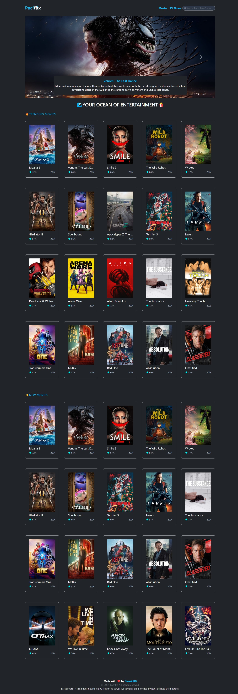
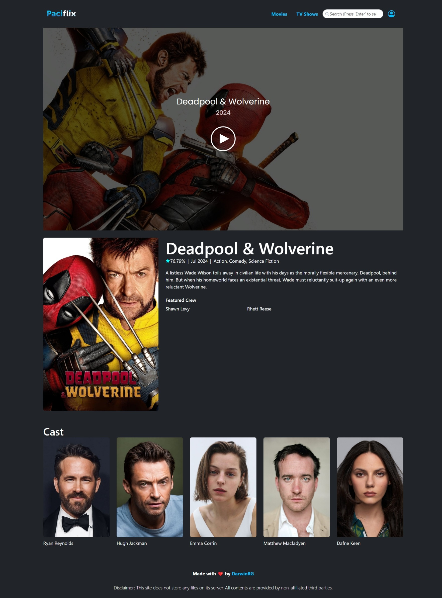

&nbsp;

# 🌊 Paciflix 🍿

Paciflix is a streaming site that offers a wide variety of movies and TV shows. Enjoy seamless streaming with our user-friendly interface and high-quality content.

## ✨ Features

- User-friendly interface
- High-quality streaming
- Wide variety of movies and TV shows
- Multiple device support
- Regular content updates
- Multi-language subtitles
- Secure and private

&nbsp;

## 🙏 Acknowledgements

- [Laravel](https://laravel.com/)
- [VidBinge](https://www.superembed.stream/)

  &nbsp;

## 🧑 Author

- [@DarwinRG](https://github.com/DarwinRG)

&nbsp;

## 📒 Requirements

### Major Requirements

- PHP 8 or higher
- Composer
- MySQL or any other supported database
- Web server (Apache, Nginx, etc.)
- Node.js and npm (for frontend dependencies)
- Git (for version control)

&nbsp;

## 🛠️ Installation

### 📥 Downloading or Cloning the Repository

You can download the repository as a ZIP file and extract it, or you can clone the repository using Git.

#### 📦 Downloading as ZIP

1. Click the "Code" button on the repository page.
2. Select "Download ZIP".
3. Extract the ZIP file to your desired location.

#### 🌀 Cloning with Git

1. Open a terminal.
2. Run the following command to clone the repository:

```sh
git clone https://github.com/DarwinRG/Paciflix.git
```

3. Navigate to the project directory:

```sh
cd Paciflix
```

### ⚙️ Initial Setup

1. Install Composer Packages
   Open a terminal and navigate to the project directory. Then run the following command to install the composer packages:

```sh
composer install
```
2. Create the Environment Variables

```sh
cp .env.example .env
```


3. Generate Application key

```sh
php artisan key:generate
```

&nbsp;

## 🔧 Environment Variables

To run this project, you will need to configure the following variables to the **.env**

| Variable Name            | Value            |
| ------------------------ | ---------------- | 
| TMDB_TOKEN               |                  | 

You need to get your TMDB Token at https://www.themoviedb.org/

&nbsp;

## ▶️ Running the application

After setting up the environment and installing the dependencies, you can run the application with:

```sh
php artisan serve
```

&nbsp;

## 📊 Output

After running the command, the terminal will generate an output

```
Starting Laravel development server: http://127.0.0.1:8000
```

You can now visit http://127.0.0.1:8000 to view the application.

### 📈 Screenshot

Homepage



Player


&nbsp;

## 📜 License

This project is licensed under the Apache License 2.0. See the [LICENSE](LICENSE) file for details.